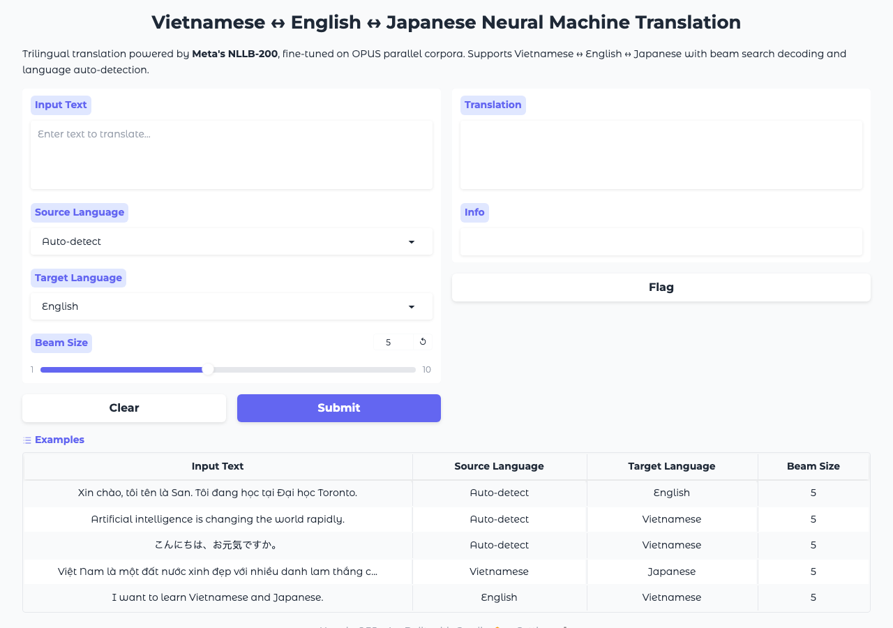

# Vietnamese–English–Japanese Neural Machine Translation

Fine-tuned **Meta's NLLB-200** on OPUS parallel corpora for **Vietnamese ↔ English ↔ Japanese** translation with beam search decoding. Deployed as a trilingual **Gradio** interface with language auto-detection.

[](https://huggingface.co/spaces/sanvo/vietnamese-nmt)

## Demo



**[Try the live demo on Hugging Face Spaces](https://huggingface.co/spaces/sanvo/vietnamese-nmt)**

## Features

- **Trilingual translation**: Vietnamese ↔ English ↔ Japanese (all 6 directions)
- **NLLB-200** fine-tuned on OPUS parallel corpora
- **Beam search decoding** with configurable beam width, length penalty, and n-gram blocking
- **Language auto-detection** using character-based heuristics (Hiragana/Katakana/Vietnamese diacritics)
- **BLEU score evaluation** with sacrebleu
- **Gradio web interface** for interactive translation

## Setup

```bash
git clone https://github.com/svn05/vietnamese-nmt.git
cd vietnamese-nmt
pip install -r requirements.txt
```

## Usage

### Translate text
```bash
python translate.py --text "Xin chào các bạn" --src vi --tgt en
python translate.py --text "Hello world" --src en --tgt ja
python translate.py --text "こんにちは" --src ja --tgt vi
```

### Train on OPUS data
```bash
# 1. Prepare parallel data
python data/prepare_opus.py --max-samples 50000

# 2. Fine-tune NLLB
python train.py --epochs 3 --batch-size 8

# 3. Evaluate BLEU
python evaluate.py
```

### Run Gradio demo
```bash
python app.py
```

### Detect language
```bash
python detect_language.py --text "Xin chào các bạn"
```

## Architecture

```
Input Text → Language Detection → Tokenization (NLLB SentencePiece)
    → NLLB-200 Encoder-Decoder → Beam Search Decoding → Translation
```

## Configuration

Edit `configs/config.yaml` to adjust:
- Model: base model name, max length
- Training: epochs, batch size, LR, warmup
- Inference: beam size, length penalty, n-gram blocking
- Languages: NLLB language codes

## Project Structure

```
vietnamese-nmt/
├── train.py              # Fine-tune NLLB on OPUS data
├── translate.py          # Translation with beam search
├── evaluate.py           # BLEU score evaluation
├── detect_language.py    # Language auto-detection
├── app.py                # Trilingual Gradio interface
├── data/
│   └── prepare_opus.py   # Download + prep OPUS parallel corpora
├── configs/
│   └── config.yaml       # Hyperparameters and settings
├── outputs/              # Saved models and results (generated)
├── requirements.txt
└── README.md
```

## Tech Stack

- **NLLB-200** (Meta) — Multilingual neural machine translation
- **HuggingFace Transformers** — Model fine-tuning and inference
- **OPUS Parallel Corpora** — Training data (via Helsinki-NLP)
- **sacrebleu** — BLEU score evaluation
- **Gradio** — Interactive trilingual web interface
